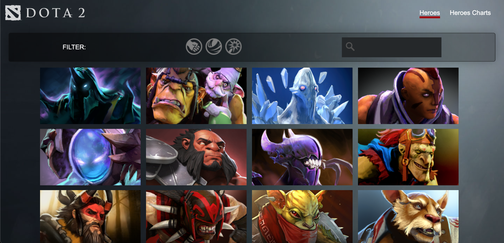
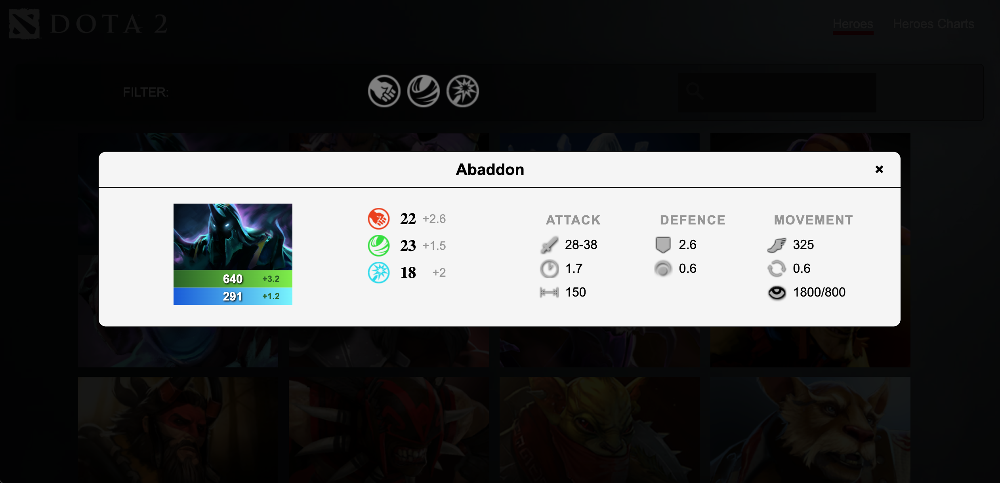
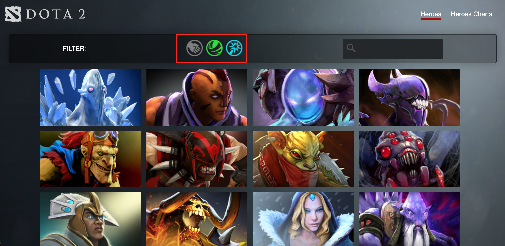
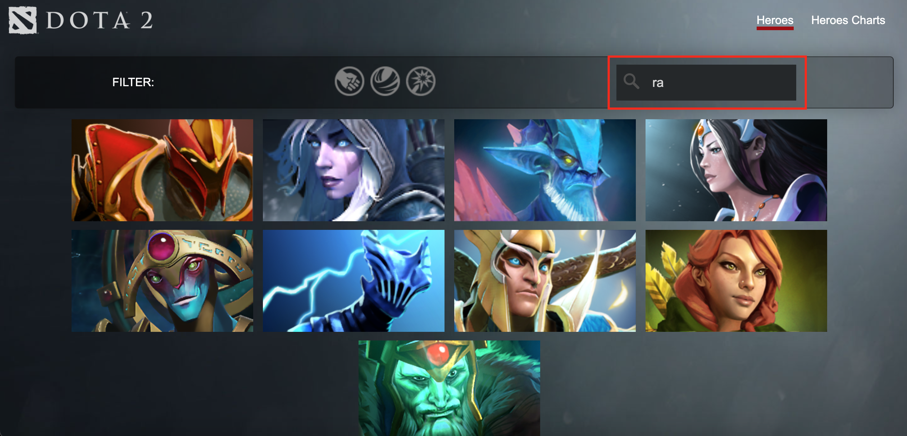
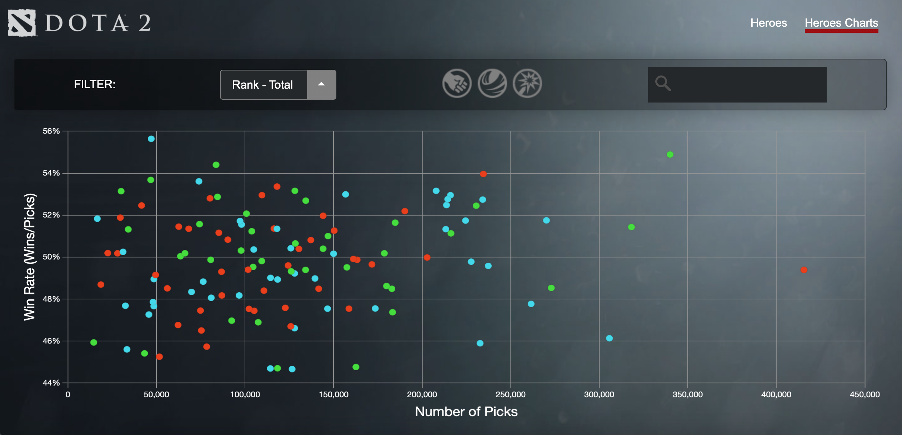
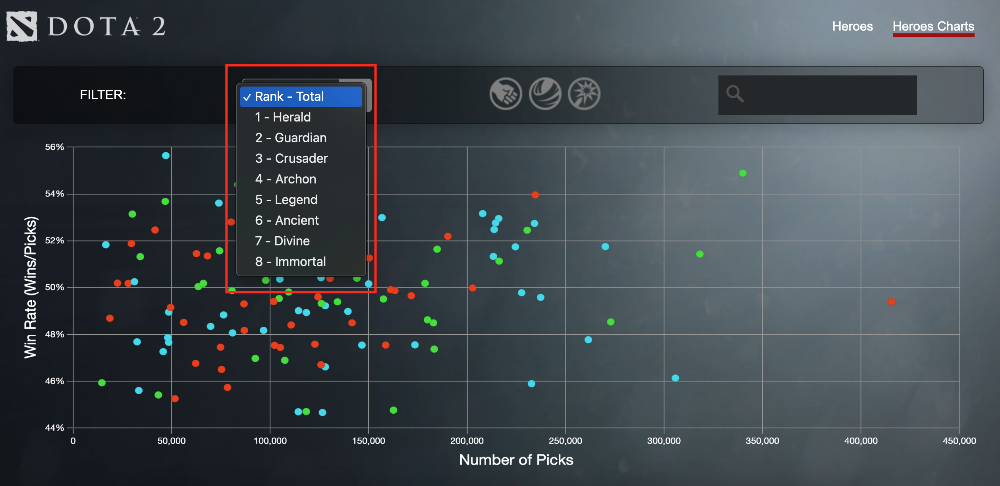
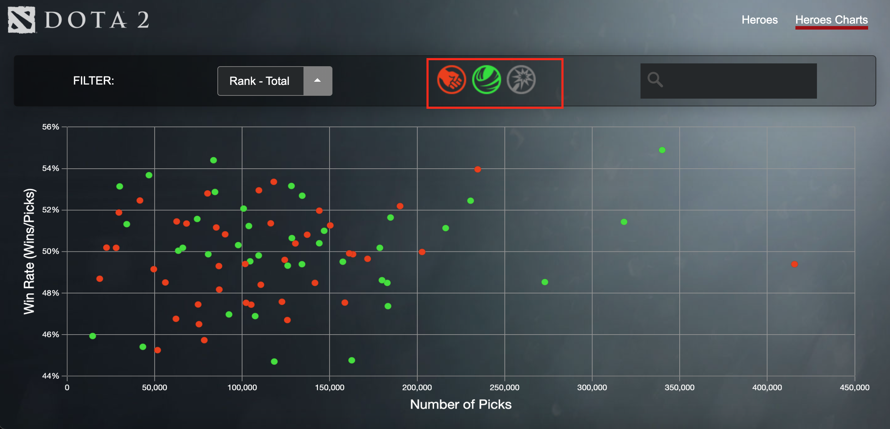
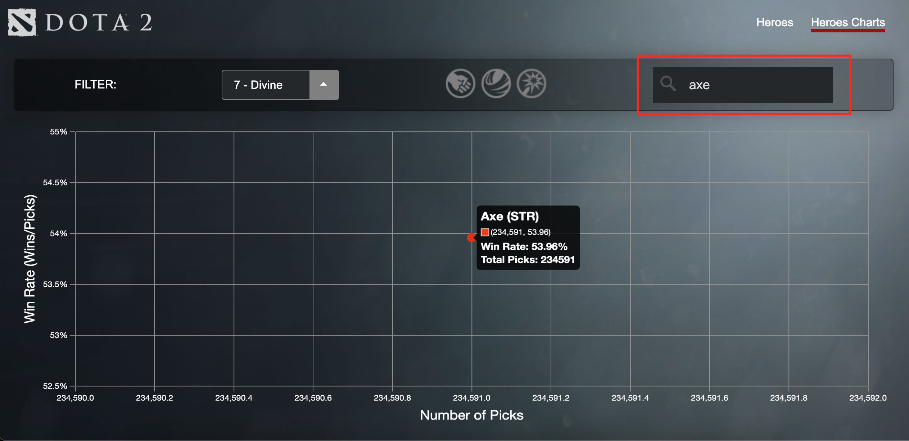
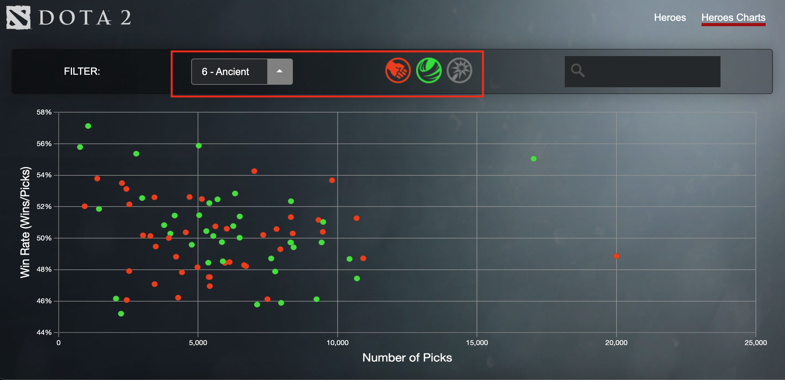

# List and Stats of DOTA2 Heroes

---
A page to view a list of DOTA2 Heroes and display a scatter chart to show popularity and success-rate of each hero.

Weblink: https://muffinthepao.github.io/DOTA2-Hero-List-and-Stats/

## Introduction

The aim of this project was to see if I could incorporate as much of what I've learnt during Unit 1 of my General Assembly (GA) Software Engineering Immersive Flex (SEIF) program.

## Things I've included to practise

- API Call
- DOM Manipulation
- Programmatically push template literal code HTML into HTML file
- Array manipulation
- Configuring library code to suit my needs
- Refactoring of code
- Constructor Class
- Init function
- CSS without Bootstrap

## Technologies

- Javascript
- HTML
- CSS
- Chart.js

## Illustrations - Heroes List

Heroes List on page load

View Hero Stats

Ability to dynamically filter Heroes List based on attributes (Strength, Agility, Intelligence)

Ability to search for Heroes

## Illustrations - Chart.js

Chart on load displays Total Picks and Total Win Rate (Total of 8 MMR Ranks)

Filter by Rank

Filter by Attribute

Filter by Search

Multiple filters working at the same chart

## Learning Challenges

- Able to create 2 constructor classes with 1 being used in the other
- Able push API call data in to constructor class
- Able to filter API call data to only what I needed
- Some CSS animations, where on mouse-hover, Hero Name is displayed
- Manipulate just 1 array for all the different functions
- Call respective functions in init()
- Use the same filter bar for both  Heroes List and Chart

## Points to Improve

- For the chart, when using search input, rather than filtering out all the Heroes, keep all Heroes on the chart but grey out the non-relevant Heroes
- Rather than the text input filter filtering out the Heroes that do not meet the filter criteria, keep the heroes in the chart but grey them out instead
